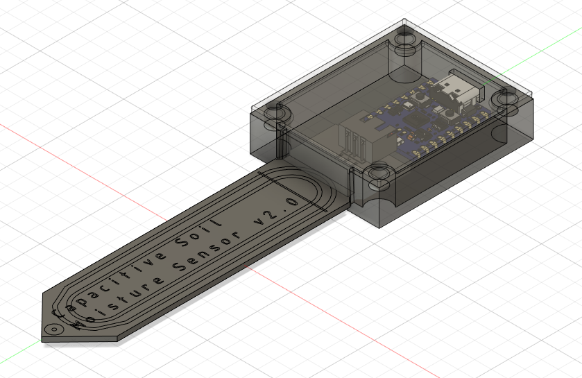
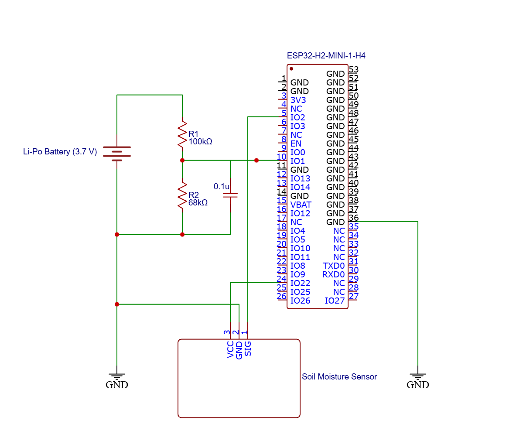
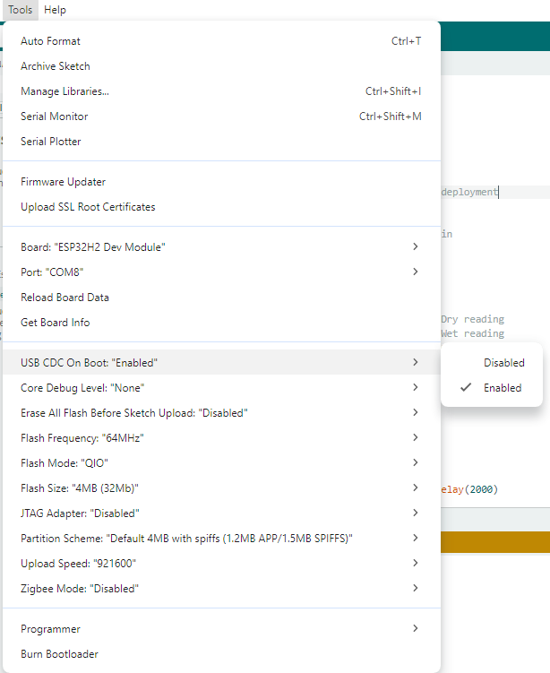

# 🌱 BLE Soil Moisture Sensor

<div align="center">


*A battery-powered, BLE-enabled soil moisture monitoring system with native Home Assistant integration*

</div>

## 📖 Overview

A low-power wireless soil moisture sensor leveraging the ESP32-H2's Bluetooth Low Energy capabilities and BTHome V2 protocol for seamless Home Assistant integration. Features ultra-low power consumption with deep sleep modes enabling 2-4 months of operation on a single 350mAh LiPo battery.

### Key Highlights

- ✅ **Native Home Assistant Support** via BTHome V2 protocol
- ✅ **Ultra-Low Power** consumption with 5-minute wake intervals
- ✅ **Three Metrics**: Soil moisture, battery voltage, and battery percentage
- ✅ **Capacitive Sensing** for corrosion-resistant measurements
- ✅ **Bluetooth 5.3 LE** with long-range support
- ✅ **Compact 3D-Printable Enclosure**



---

## ✨ Features

| Feature | Description |
|---------|-------------|
| **BTHome V2 Protocol** | Automatic Home Assistant discovery with zero configuration |
| **Deep Sleep Mode** | 5-minute sleep cycles for extended battery life |
| **Tri-Sensor System** | Monitors soil moisture (0-100%), battery voltage (V), and charge level (%) |
| **Capacitive Technology** | FR4-based sensor resistant to corrosion and oxidation |
| **BLE 5.3** | Reliable 10m+ range with -106.5 dBm receiver sensitivity |
| **LED Status Indicator** | Optional WS2812B NeoPixel for visual feedback |
| **Battery Optimization** | Sensor power control, minimal LED brightness, efficient ADC sampling |

---

## 🔧 Hardware Components

### Required Parts

| Component | Specification | Notes |
|-----------|--------------|-------|
| **ESP32-H2 Super Mini** | 32-bit RISC-V @ 96 MHz | [Board Info](https://www.espboards.dev/esp32/esp32-h2-super-mini/) |
| **Capacitive Soil Moisture Sensor** | 3.3-5.5V, Analog output | FR4 material, corrosion-resistant |
| **LiPo Battery** | 350mAh, 3.7V | JST connector recommended |
| **Resistors** | 2× 100kΩ ±1% | For voltage divider |
| **Capacitor** | 2× 0.1µF ceramic | ADC filtering |

### ESP32-H2 Specifications

- **MCU**: 32-bit RISC-V single-core @ 96 MHz
- **RAM**: 320 KB SRAM
- **Flash**: 4 MB
- **Bluetooth**: 5.3 LE (802.15.4 compatible)
- **Sleep Current**: < 5 µA (deep sleep)
- **GPIO**: 22 programmable pins

### Soil Moisture Sensor Specs

- **Operating Voltage**: 3.3V - 5.5V DC
- **Current Consumption**: ~5mA (active), 0µA (powered off)
- **Output**: Analog 0-3.0V
- **Dimensions**: 98mm × 23mm × 4mm
- **Sensing Depth**: ~50mm

---

## 🔌 Pin Configuration

| Function | GPIO Pin | Type | Description |
|----------|----------|------|-------------|
| **Moisture Sensor Data** | GPIO2 | Analog Input (ADC1_CH1) | Reads soil moisture voltage |
| **Moisture Sensor Power** | GPIO10 | Digital Output | Powers sensor only during readings |
| **Battery Voltage** | GPIO1 | Analog Input (ADC1_CH0) | Monitors battery via voltage divider |
| **Status LED** | GPIO8 | Digital Output (PWM) | WS2812B NeoPixel indicator |

### Wiring Diagram



> ⚠️ **Important**: Place the 0.1µF capacitors as close as possible to the ESP32 ADC pin (GPIO1) for accurate voltage readings.

---

## 🚀 Installation

### Prerequisites

- **Arduino IDE** 2.0+ or PlatformIO
- **ESP32 Board Package** 3.0.0+
- **Home Assistant** 2022.9+ with Bluetooth integration enabled

### Step 1: Install Arduino Libraries

Open Arduino IDE → **Tools** → **Manage Libraries**, then search and install:

1. **NimBLE-Arduino** by h2zero (v1.4.0+)
2. **FastLED** by FastLED (v3.6.0+)

### Step 2: Configure Arduino IDE

1. **Add ESP32 Board Manager URL**:
   - File → Preferences → Additional Board Manager URLs
   - Add: `https://espressif.github.io/arduino-esp32/package_esp32_index.json`

2. **Install ESP32 Boards**:
   - Tools → Board → Boards Manager
   - Search "esp32" by Espressif Systems
   - Install version **3.0.0** or newer

3. **Select Board**:
   - Tools → Board → ESP32 Arduino → **ESP32H2 Dev Module**

4. **Configure Settings**:
Board: ESP32H2 Dev Module
Upload Speed: 921600
CPU Frequency: 96MHz
Flash Mode: QIO
Flash Size: 4MB
Partition Scheme: Default 4MB with spiffs
Core Debug Level: None

> For USB debugging ensure `USB CDC on Boot` is enabled



### Step 3: Upload Firmware

1. Connect ESP32-H2 via USB-C
2. Select correct **COM port** (Tools → Port)
3. Click **Upload** button
4. Wait for "Done uploading" message

---

## ⚙️ Configuration

### Moisture Sensor Calibration

**Required for accurate readings!**

1. Upload the calibration sketch: [`moisture_sensor_calibrate.ino`](./Arduino%20Sketch/moisture_sensor_calibrate.ino)

2. **Dry Air Reading**:
- Keep sensor in open air
- Record ADC value (typically ~2048-3500)

3. **Water Reading**:
- Submerge sensor in water **up to the MAX line only**
- Record ADC value (typically ~768-1200)

4. **Update Configuration**:
```cpp
#define MOISTURE_SENSOR_READING_IN_AIR 2048 // Your dry value
#define MOISTURE_SENSOR_READING_IN_WATER 784 // Your wet value
```

### Battery Voltage Calibration

1. Measure actual battery voltage with multimeter (e.g., 4.00V)
2. Upload code and check serial monitor output
3. Calculate calibration factor:

```
Calibration Factor = Multimeter Voltage / Reported Voltage
Example: 4.00V / 3.41V = 1.173
```
4. Update `readBatteryVoltage()` function:

```
float batteryVoltage = adcVoltage * multiplier;
batteryVoltage = batteryVoltage * 1.173; // Apply calibration factor
```

### Voltage Divider Configuration

For **100kΩ + 100kΩ** resistors (recommended):

```
#define VOLTAGE_DIVIDER_RESISTOR_1_KO 100 // Connected to Battery+
#define VOLTAGE_DIVIDER_RESISTOR_2_KO 100 // Connected to GND
```

**Resistor tolerance**: Use 1% tolerance for best accuracy.

### Optional Settings

**Change Device Name**:

```
#define DEVICE_NAME "Garden Sensor 1" // Appears in Home Assistant
```

**Adjust Sleep Interval**:

```
const uint64_t SLEEP_TIME = 10ULL * 60ULL * 1000000ULL; // 10 minutes
```
**Disable LED** (for maximum battery life):
```cpp
#define BLINK_LED false
```

**Debug Mode**:
```cpp
#define DEBUG true // Enable serial output
#define DEBUG false // Disable for deployment
```


---

## 🏠 Home Assistant Integration

### Automatic Discovery

Home Assistant automatically discovers the sensor via BTHome V2 protocol—no YAML configuration required!

### Step-by-Step Setup

#### 1. Ensure Prerequisites

✅ Home Assistant 2022.9 or later  
✅ **Bluetooth integration** enabled (Settings → Devices & Services → Bluetooth)  
✅ ESP32-H2 powered on and within 10m range

#### 2. Discover Device

1. Navigate to **Settings** → **Devices & Services**
2. Look for **"Discovered"** section
3. Find **"Soil Moisture Sensor"** (BTHome integration)
4. Click **"Configure"**

#### 3. Complete Setup

1. Click **"Submit"** on the BTHome configuration dialog
2. Assign to an **Area** (e.g., "Garden", "Balcony", "Living Room")
3. Click **"Finish"**

#### 4. Verify Entities

Three sensor entities are automatically created:

| Entity ID | Description | Unit |
|-----------|-------------|------|
| `sensor.soil_moisture_sensor_moisture` | Soil moisture percentage | % |
| `sensor.soil_moisture_sensor_battery` | Battery charge level | % |
| `sensor.soil_moisture_sensor_voltage` | Battery voltage | V |

#### 5. Add to Dashboard

1. Go to your Home Assistant **Overview**
2. Click **"Edit Dashboard"** (top right)
3. Click **"+ Add Card"** → **"Entities"**
4. Select all three sensor entities
5. Click **"Save"**

### Manual Addition (Troubleshooting)

If auto-discovery fails:

1. Settings → Devices & Services → **BTHome**
2. Click **"+ Add Entry"**
3. Press **RESET button** on ESP32-H2
4. Click **"Configure"** when device appears

### BTHome V2 Protocol Details

| Parameter | Value |
|-----------|-------|
| **Service UUID** | 0xFCD2 |
| **Protocol Version** | V2 (unencrypted) |
| **Device Type** | Not trigger-based |
| **Packet Format** | `0x40` + Object IDs + Data |

**Transmitted Data**:
- Object ID `0x01`: Battery % (uint8)
- Object ID `0x0C`: Voltage in mV (uint16, little-endian)
- Object ID `0x14`: Moisture % × 100 (uint16, little-endian)

**Advertisement Frequency**: Every 5 minutes (configurable)

---

## ⚡ Power Optimization


### Optimization Tips

1. **Disable LED**: Set `#define BLINK_LED false`
2. **Increase Sleep Interval**: Change to 10 or 15 minutes
3. **Reduce Advertising Packets**: Change loop from 3 to 2 iterations
4. **Disable Debug**: Set `#define DEBUG false` before deployment
5. **Use Larger Battery**: Upgrade to 500mAh or 1000mAh LiPo

---

## 🐛 Troubleshooting

### Device Not Discovered in Home Assistant

**Solutions**:
- ✅ Verify Bluetooth integration is enabled
- ✅ Check ESP32 is within 10m range
- ✅ Press RESET button to force advertising
- ✅ Wait for next wake cycle (up to 5 minutes)
- ✅ Check HA logs for BTHome errors

### Entities Show "Unavailable"

**Solutions**:
- ✅ Check battery voltage (>3.0V required)
- ✅ Verify LED blinks on wake
- ✅ Reduce distance to HA Bluetooth adapter
- ✅ Delete and re-add device in HA

### Inaccurate Moisture Readings

**Solutions**:
- ✅ Recalibrate sensor using calibration sketch
- ✅ Verify sensor properly inserted into soil
- ✅ Check GPIO22 outputs 3.3V during reads
- ✅ Inspect sensor for physical damage

### Incorrect Battery Voltage

**Solutions**:
- ✅ Apply calibration factor based on multimeter reading
- ✅ Verify 100kΩ voltage divider resistors
- ✅ Check 0.1µF capacitor placement
- ✅ Use 1% tolerance resistors

### Multiple Devices Appearing

**Solutions**:
- ✅ BLE MAC address changing on each boot
- ✅ Update to ESP32 board package 3.0.0+
- ✅ Delete duplicate devices from HA
- ✅ Wait for device re-discovery after deletion

---

## 📚 Reference Documentation

### Official Resources

- [BTHome V2 Specification](https://bthome.io/format/)
- [ESP32-H2 Datasheet](https://www.espressif.com/sites/default/files/documentation/esp32-h2_datasheet_en.pdf)
- [NimBLE-Arduino Library](https://github.com/h2zero/NimBLE-Arduino)
- [Home Assistant BTHome Integration](https://www.home-assistant.io/integrations/bthome/)

### Community Resources

- [ESP32 Board Details](https://www.espboards.dev/esp32/esp32-h2-super-mini/)
- [FastLED Documentation](https://github.com/FastLED/FastLED)

---

## 🤝 Contributing

Contributions are welcome! Please follow these guidelines:

1. **Fork** the repository
2. Create a **feature branch**: `git checkout -b feature/amazing-feature`
3. **Commit** changes: `git commit -m 'Add amazing feature'`
4. **Push** to branch: `git push origin feature/amazing-feature`
5. Open a **Pull Request**

## 📄 License

This project is licensed under the **MIT License**.

---

## 🙏 Acknowledgments

- **BTHome Protocol** - For simple and efficient BLE data format
- **NimBLE-Arduino** - For lightweight BLE stack implementation
- **FastLED** - For easy WS2812B LED control
- **Home Assistant Community** - For integration support

---

<div align="center">

**Made with 💚 for Smart Gardening**

⭐ Star this project if you found it helpful! ⭐

</div>

